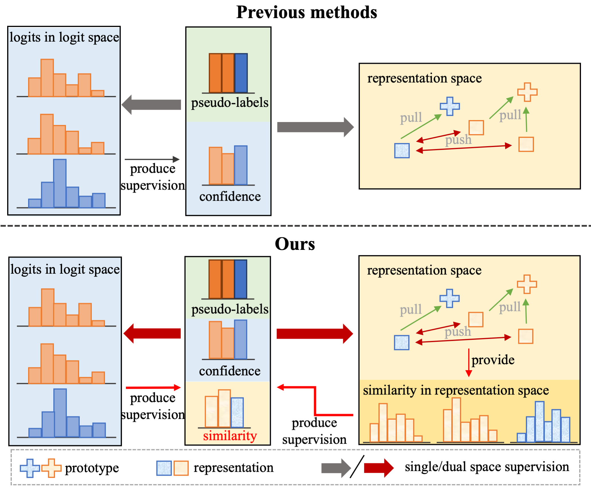
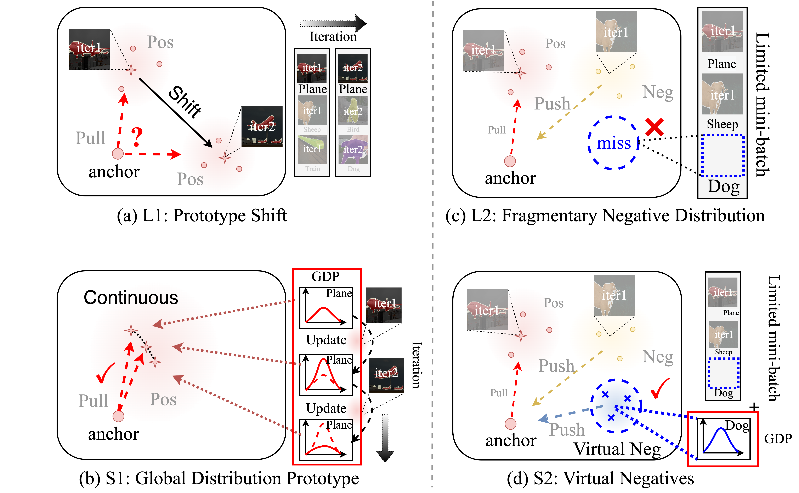
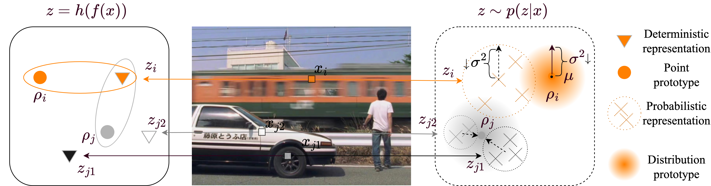

# 🙋 About Me
I am a current master student at Northeastern University, China and interested in a wide array of DL/CV topics, ranging from low-level vision to high-level vison. Recently, I have been working on the semi-supervised semantic segmentation, contrastive learning and medical image analysis.

 

# 🔥 News
* *2023.07*: One paper accepted to ICCV 2023!
* *2022.11*: One paper accepted to AAAI 2023!

 

# 📝 Publications

这是我的照片：

<table>
<tr align="left">
<td></td>
<td>
 <b>Space Engage: Collaborative Space Supervision for Contrastive-based Semi-Supervised Semantic Segmentation (ICCV 2023)</b>  
 <u>Changqi Wang</u>, Haoyu Xie, Yuhui Yuan, Chong Fu, Xiangyu Yue  
[\[paper\]](https://ojs.aaai.org/index.php/AAAI/article/view/25396) [\[code\]](https://github.com/Haoyu-Xie/PRCL) 
</td>
</tr>

</table>
<table>
<tr align="left">
<td></td>
<td>
 <b>PRCL: A Probabilistic View for Contrastive-based Semi-Supervised Semantic Segmentation (Submitted to IJCV)</b>  
Haoyu Xie, <u>Changqi Wang</u>, Yang Liu, Jun Dan, Chong Fu, Jan Zhao, Baigui Sun  
<a herf='https://ojs.aaai.org/index.php/AAAI/article/view/25396'>[paper]</a><a herf='https://ojs.aaai.org/index.php/AAAI/article/view/25396'>[code]</a>
</td>
</tr>
 
</table>
<table>
<tr align="left">
<td></td>
<td>
 <b>Boosting Semi-Supervised Semantic Segmentation with Probabilistic Representations (AAAI 2023 oral)</b>  
 Haoyu Xie, <u>Changqi Wang</u>, Mingkai Zheng, Minjing Dong, Chong Fu, Chang Xu  
[\[paper\]](https://ojs.aaai.org/index.php/AAAI/article/view/25396) [\[code\]](https://github.com/Haoyu-Xie/PRCL) 
</td>
</tr>
</table>

# 🎖 Honors and Awards
* *2022.09*: Second Class Master Scholarship of Northeastern University
* *2021.09*: President's Scholarship of Northeastern University (Top 5%)
* *2021.06*: Outstanding Graduate of Northeastern University (Top 10%)
* *2020.09*: First Class Undergraduate Scholarship of Northeastern University (Top 10%)
* *2020.09*: Postgraduate Candidates Exempt from Admission Exam (8/95)
* *2019.08*: Provincial Second Prize in Liaoning Province Electronic Design Competition (2/40)

 

# 📖 Educations
- *2021.09 - now*, M.E., Northeastern University, Shenyang, China
- *2017.09 - 2021.06*, B.E., Northeastern University, Shenyang, China
